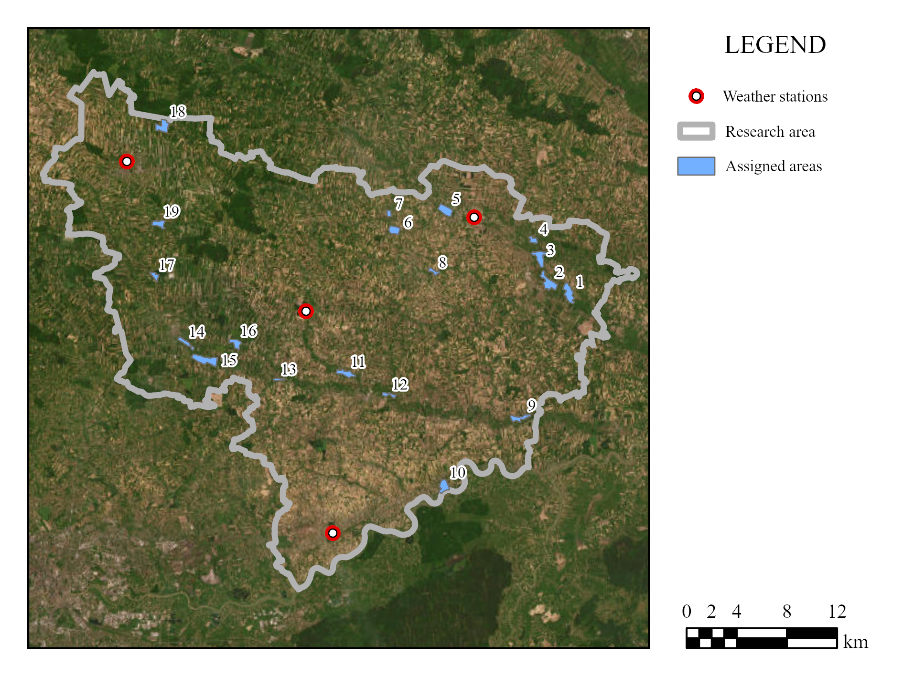
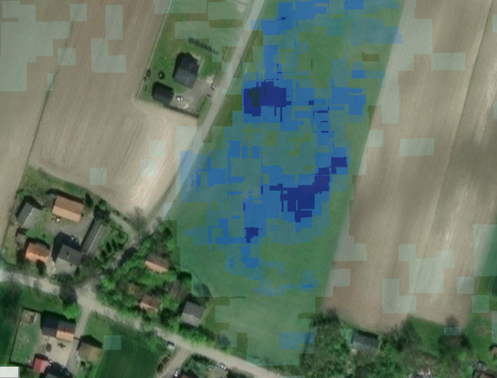
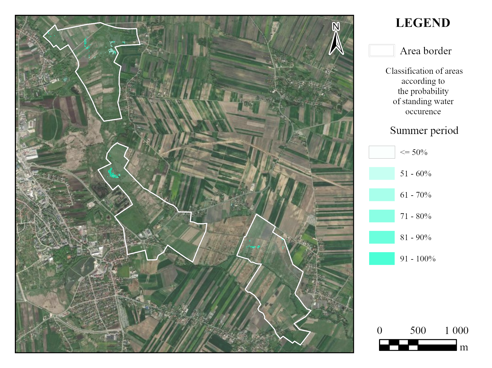

# Detection of Standing Water in Agricultural Areas Using Machine Learning

## Introduction

In recent years, advancements in satellite remote sensing, such as the Copernicus mission, have revolutionized spatial analysis, allowing for greater detail and shorter revisit times. This project focuses on using satellite and meteorological data to automatically detect standing water in agricultural fields, meadows, and unpaved paths. The detection of water accumulation is important for managing crop yield, soil health, and groundwater levels. By using machine learning models, the process is automated, providing predictions even when satellite data are not available for a given time.

## Workflow Overview

The project is structured as follows:

1. **Selecting the Research Area**: The area includes fields and paths where standing water is likely to accumulate after rainfall.


   
2. **Loading Data for Initial Analysis**: 
   - **Spectral Data**: Multispectral imagery from Sentinel-2.
   - **Radar Data**: Data from Sentinel-1 radar satellites.
   - **Meteorological Data**: Precipitation and other weather data.
   - **Ground Data**: Field data used for validating model predictions.

3. **Integrating Spectral and Radar Data**: Combining radar and spectral data to enhance water detection accuracy.

4. **Manual Identification of Standing Water Areas**: Ground truth data was manually annotated to help train the model.



5. **Building the Machine Learning Model**: A regression-based model was built to predict standing water based on meteorological and satellite data.

6. **Analyzing Results**: The model was applied to predict water accumulation areas, and results were visualized on maps for comparison with manual observations.



## Libraries Used

To replicate this project, ensure the following libraries are installed:

- `geemap`: For interacting with Google Earth Engine and visualizing geospatial data.
- `rasterio`: For reading and writing raster datasets.
- `earthengine-api`: For accessing satellite data from Google Earth Engine.
- `scikit-learn`: For building and validating the machine learning model.
- `numpy`: For numerical data manipulation.
- `pandas`: For data processing and handling tabular data.
- `matplotlib`: For visualizing data.
- `seaborn`: For enhanced data visualization.
- `xgboost`: For implementing the regression model.

## Running the Analysis

1. Install the required libraries:
    ```bash
    pip install geemap rasterio earthengine-api scikit-learn numpy pandas matplotlib seaborn xgboost
    ```

2. Authenticate Google Earth Engine (GEE) and initialize it in your Jupyter environment:
    ```python
    import ee
    ee.Authenticate()
    ee.Initialize()
    ```

3. Run the notebook to reproduce the analysis and view the results.

## Results

- The machine learning model successfully predicts areas with standing water based on meteorological and satellite data.
- Predictions are visualized on interactive maps to help identify key regions of concern.
- The approach offers a valuable tool for decision-making in agriculture and land management.

## Acknowledgements

This project uses data from the Copernicus Sentinel missions and meteorological datasets. Special thanks to Google Earth Engine for providing the data analysis platform.
